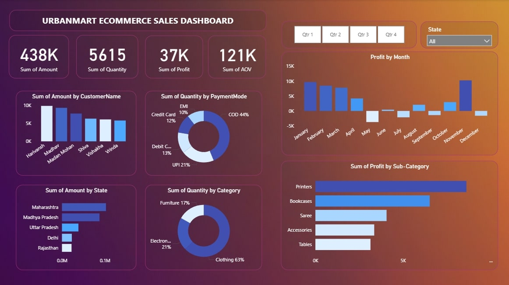

# **UrbanMart E-Commerce Sales Dashboard**

## Dashboard Preview
### About
This Power BI dashboard provides comprehensive sales insights and analysis for UrbanMart.

## Project Overview
An interactive Power BI dashboard designed to track, analyze, and visualize e-commerce sales performance for UrbanMart. This comprehensive analytical solution transforms raw transactional data into actionable business insights, enabling data-driven decision-making across sales, inventory, and customer management functions.
Purpose: To provide stakeholders with real-time visibility into sales performance, customer behavior, payment preferences, and regional trends through an intuitive, interactive dashboard interface.

## Tech Stack

- Power BI Desktop - Data visualization and dashboard development
- Power Query - Data transformation and ETL operations
- DAX (Data Analysis Expressions) - Custom calculations and measures
- Excel/CSV - Raw data source format

## Data Source
**Sample E-commerce Dataset** - Simulated transactional data created for 
demonstration and learning purposes, representing a fictional online retail 
store (UrbanMart). The dataset includes:
- Customer purchase records
- Product catalog across multiple categories
- Order transactions with amounts and quantities
- Payment method information
- Geographic data (Indian states)
- Time-series data spanning one year

## Features and Highlights
**Business Problem**

UrbanMart faced challenges in:

Lack of unified visibility into sales performance across regions and time periods
Difficulty identifying high-value customers and profitable product categories
Limited insights into payment method preferences and their impact on sales
Inability to track monthly profit trends and seasonal patterns
Disconnected data making it hard to analyze relationships between customers, products, and regions

## Dashboard Goals

Centralized Performance Monitoring - Single source of truth for all sales KPIs
Customer Intelligence - Identify top customers and purchasing patterns
Product Profitability Analysis - Determine which categories and sub-categories drive profits
Regional Performance Tracking - Understand state-wise sales distribution
Trend Analysis - Monitor temporal patterns in profits and sales
Payment Insights - Analyze customer payment preferences to optimize checkout experiences

## Key Visuals & Their Purpose
### 1. KPI Cards (Top Metrics)

Charts Used: Card visuals
Metrics Displayed: Sum of Amount (438K), Quantity (5,615), Profit (37K), AOV (121K)
Purpose: Provides at-a-glance view of critical business metrics for quick performance assessment
Business Value: Enables executives to instantly gauge overall business health

### 2. Sum of Amount by CustomerName (Clustered Bar Chart)

Chart Type: Vertical bar chart
Purpose: Identifies top revenue-generating customers (Harivansh, Madan Mohan, Madhav, Shiva, Vishakha, Vritika)
Why This Chart: Bar charts effectively compare discrete categories, making it easy to rank customers by contribution
Insight: Madan Mohan appears to be the highest-value customer, guiding customer retention strategies

### 3. Sum of Quantity by PaymentMode (Donut Chart)

Chart Type: Donut chart with percentage breakdown
Distribution: COD (44%), UPI (21%), Debit Card (13%), Credit Card (12%), EMI (10%)
Purpose: Visualizes payment method preferences across the customer base
Why This Chart: Donut charts effectively show part-to-whole relationships with visual appeal
Insight: Cash on Delivery dominates, suggesting need for trust-building or incentives for digital payments

### 4. Profit by Month (Area Chart)

Chart Type: Area chart with trend line
Purpose: Tracks monthly profit fluctuations throughout the year
Why This Chart: Area charts emphasize cumulative values and trends over time, showing magnitude of changes
Insight: November shows peak profitability, while May shows significant losses - critical for seasonal planning

### 5. Sum of Amount by State (Horizontal Bar Chart)

Chart Type: Horizontal bar chart
States Ranked: Maharashtra (highest), Madhya Pradesh, Uttar Pradesh, Delhi, Rajasthan
Purpose: Compares sales performance across different states
Why This Chart: Horizontal bars are ideal when category names are longer, improving readability
Insight: Maharashtra leads sales, indicating where to focus marketing investments and inventory

### 6. Sum of Quantity by Category (Donut Chart)

Chart Type: Donut chart
Categories: Clothing (63%), Electronics (21%), Furniture (17%)
Purpose: Shows product category distribution in sales volume
Why This Chart: Quickly communicates product mix composition
Insight: Clothing dominates inventory turnover, requiring focused inventory management

### 7. Sum of Profit by Sub-Category (Horizontal Bar Chart)

Chart Type: Horizontal bar chart
Categories: Printers, Bookcases, Saree, Accessories, Tables
Purpose: Identifies most and least profitable product sub-categories
Why This Chart: Enables easy comparison of profitability across multiple sub-categories
Insight: Printers are most profitable; Tables show lower margins - guides product portfolio decisions

### 8. Interactive Filters

Quarter Buttons (Qtr 1-4): Enables time-based filtering
State Dropdown: Allows regional drill-down analysis
Purpose: Empowers users to customize views and explore specific segments
Business Value: Self-service analytics reducing dependency on technical teams

## Business Impact and Insights
**Strategic Insights Delivered:**

Customer Concentration Risk: Top 6 customers drive significant revenue - diversification needed
Payment Infrastructure Gap: 44% COD preference indicates opportunity to incentivize digital payments, reducing operational costs
Seasonal Profitability: November peak and May trough require strategic inventory and promotional planning
Geographic Expansion Opportunity: Maharashtra's dominance suggests replication potential in other states
Product Portfolio Optimization: Clothing's 63% share requires robust supply chain; high-margin printers deserve promotional focus
Profitability vs. Volume Gap: Understanding why high-volume categories don't always equal high profits enables pricing strategy refinement

**Measurable Outcomes:**

Reduced Analysis Time: From hours to seconds with interactive filters
Improved Decision Speed: Real-time KPIs enable faster response to market changes
Enhanced Customer Targeting: Clear visibility into high-value customer segments
Optimized Inventory: Data-driven allocation based on regional and category performance
Revenue Opportunities Identified: Payment method optimization and geographic expansion potential worth exploring

## Technical Implementation Highlights

Established complex data relationships between customer, product, and transaction tables
Created calculated columns and measures using DAX for Average Order Value (AOV) and profit margins
Implemented dynamic filtering with slicers for quarters and states
Applied conditional formatting to highlight performance anomalies
Designed responsive layout optimized for executive presentations

## Future Enhancements

- Real-time data integration via APIs
- Predictive analytics for demand forecasting
- Customer segmentation using RFM analysis
- Mobile-responsive dashboard version
- Automated email reports for stakeholders
